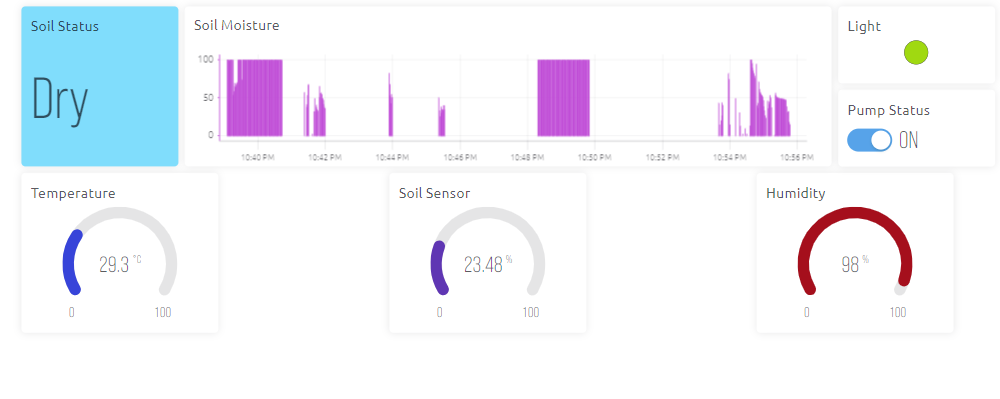

# Iot Base Smart Plant Monitoring System

## Overview

The Plant Monitoring System is an IoT-based solution designed to automate and enhance the care of plants by monitoring soil moisture, temperature, and humidity levels. This repository contains the code and details for the project.

## Features

- Soil moisture sensing for accurate watering decisions.
- Temperature and humidity monitoring for optimal plant growth conditions.
- Remote access and control through IoT platform (Blynk).
- Water pump automation based on soil moisture levels.

## Components Used

- NodeMCU (ESP8266) development board.
- Soil Moisture Sensor.
- DHT11 Temperature and Humidity Sensor.
- Relay Module for water pump control.
- 5v Submersible Pump

## Circuit Diagram

The hardware components are connected as follows:

- Connect the Soil Moisture Sensor to the analog pin A0 of NodeMCU.
- Connect the DHT11 Sensor to the digital pin D4 of NodeMCU.
- Connect the Relay Module to the digital pin D5 of NodeMCU.
- Connect the Water Pump to the Relay Module.
- Power the NodeMCU using a USB cable.

## Setup Instructions

1. Clone this repository to your local machine.
2. Set up your Blynk account and create a new project to get an authentication token.
3. Update the code with your Wi-Fi credentials and Blynk authentication token.
4. Upload the code to the NodeMCU.
5. Assemble the hardware components according to the circuit diagram.
6. Power on the NodeMCU and monitor the plant conditions remotely using the Blynk app.

## Usage

- The system continuously monitors soil moisture, temperature, and humidity levels.
- Watering decisions are based on predefined moisture thresholds:
  - If soil moisture is below the dry threshold, the water pump is activated.
  - If soil moisture is above the dry threshold but below the optimal threshold, no watering occurs.
- Remote access through the Blynk app allows real-time monitoring and control.

## Future Scope

- Integration of additional sensors for light intensity and pH levels.
- Enhancement of decision logic using machine learning algorithms.
- Integration with weather forecasts for smarter watering decisions.

## Limitations

- Dependency on Wi-Fi connectivity.
- Sensor accuracy variations.
- Maintenance requirements.

## Acknowledgments

- [Blynk](https://blynk.io/) for providing the IoT platform.
- [Adafruit](https://www.adafruit.com/) for the DHT11 sensor library.
- Arduino IDE for uploading code

## License

This project is licensed under the [MIT License](LICENSE).
